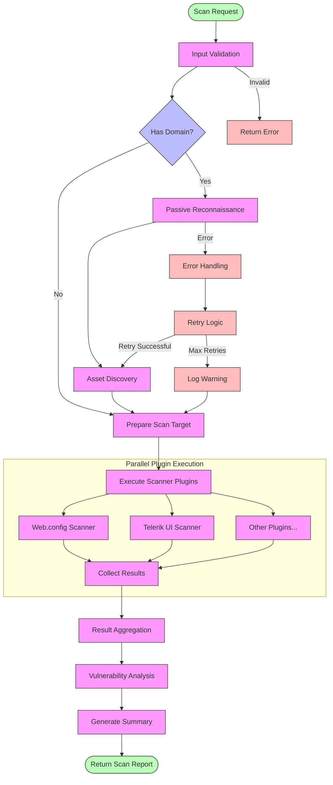
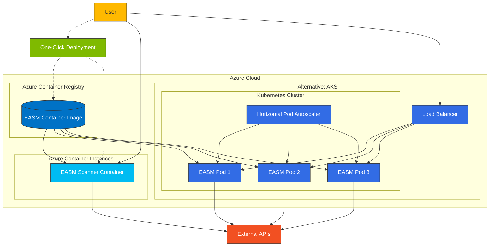

```mermaid
flowchart TB
    subgraph "User Interface"
        API[RESTful API]
        CLI[Command Line Interface]
    end

    subgraph "Core Framework"
        Scanner[Security Scanner Core]
        PluginManager[Plugin Manager]
        HTTP[HTTP Client]
        RateLimit[Rate Limiter]
    end
    
    subgraph "Scanner Plugins"
        WebConfig[Web.config Scanner]
        Telerik[Telerik UI Scanner]
        ViewHacks[View-Hacks Scanner]
        FuturePlugins[Future Plugins...]
    end
    
    subgraph "Asset Discovery"
        Passive[Passive Reconnaissance]
        Active[Active Reconnaissance]
        direction TB
        subgraph "Data Sources"
            CertLogs[Certificate Transparency]
            DNS[DNS Records]
            WHOIS[WHOIS Data]
            ThirdParty[Third-Party Services]
        end
    end
    
    subgraph "Deployment Options"
        Docker[Docker Container]
        ACI[Azure Container Instances]
        K8s[Kubernetes]
    end
    
    subgraph "External Services"
        Shodan[(Shodan API)]
        Censys[(Censys API)]
        SecTrails[(SecurityTrails API)]
    end
    
    %% Connections
    API --> Scanner
    CLI --> Scanner
    
    Scanner --> PluginManager
    Scanner --> Passive
    Scanner --> Active
    
    PluginManager --> WebConfig
    PluginManager --> Telerik
    PluginManager --> ViewHacks
    PluginManager --> FuturePlugins
    
    WebConfig --> HTTP
    Telerik --> HTTP
    ViewHacks --> HTTP
    
    Passive --> CertLogs
    Passive --> DNS
    Passive --> WHOIS
    Passive --> ThirdParty
    
    Passive --> Shodan
    Passive --> Censys
    Passive --> SecTrails
    
    HTTP --> RateLimit
    
    %% Deployment connections
    Docker -.-> Scanner
    ACI -.-> Scanner
    K8s -.-> Scanner

    %% Styling
    classDef core fill:#f9f,stroke:#333,stroke-width:2px
    classDef plugin fill:#bbf,stroke:#333,stroke-width:1px
    classDef discovery fill:#bfb,stroke:#333,stroke-width:1px
    classDef ui fill:#fbb,stroke:#333,stroke-width:1px
    classDef deployment fill:#ddd,stroke:#333,stroke-width:1px,stroke-dasharray: 5 5
    classDef external fill:#ffd,stroke:#333,stroke-width:1px
    
    class Scanner,PluginManager,HTTP,RateLimit core
    class WebConfig,Telerik,ViewHacks,FuturePlugins plugin
    class Passive,Active,CertLogs,DNS,WHOIS,ThirdParty discovery
    class API,CLI ui
    class Docker,ACI,K8s deployment
    class Shodan,Censys,SecTrails external
```

# EASM Solution - External Attack Surface Management

A comprehensive, production-ready External Attack Surface Management solution built with TypeScript and Node.js.

## Features

- **Comprehensive Vulnerability Scanning**: Detect web application vulnerabilities, exposed configuration files, and more
- **Web Component Analysis**: Scan for security issues in common web components (Telerik UI, etc.)
- **Asset Discovery**: Identify your complete external attack surface using passive and active techniques
- **Modular Architecture**: Easily extend with custom scanning plugins
- **Scalable Design**: Built to handle enterprise-scale scanning with rate limiting and worker distribution
- **Cloud-Native**: Deploy to Azure with a single command
- **API & CLI Interface**: Use as an API service or command-line tool

## Quick Start

### One-liner Azure Deployment

Deploy the EASM Scanner to Azure in one command using Azure Cloud Shell:

```bash
curl -sL https://raw.githubusercontent.com/DataGuys/DGEASM/main/install.sh | bash
```

This will automatically:
1. Clone the repository
2. Create Azure resources
3. Build and deploy the Docker container
4. Configure the service
5. Output the service URL

### Local Development

1. Clone the repository:
```bash
git clone https://github.com/DataGuys/DGEASM.git
cd DGEASM
```

2. Install dependencies:
```bash
npm install
```

3. Run in development mode:
```bash
npm run dev
```

4. Build for production:
```bash
npm run build
```

5. Run in production mode:
```bash
npm start
```

### Using Docker

```bash
# Build the image
docker build -t easm-solution .

# Run the container
docker run -p 3000:3000 easm-solution
```

### Using Docker Compose

```bash
docker-compose up -d
```

## API Usage

### Vulnerability Scanning

```bash
curl -X POST http://localhost:3000/api/scan \
  -H "Content-Type: application/json" \
  -d '{
    "url": "https://example.com",
    "options": {
      "timeout": 10000,
      "depth": 3,
      "followRedirects": true
    }
  }'
```

### Asset Discovery

```bash
curl -X POST http://localhost:3000/api/discover \
  -H "Content-Type: application/json" \
  -d '{
    "domain": "example.com"
  }'
```

### CLI Usage

```bash
# Scan a URL directly
npm start -- https://example.com
```

## Scanner Capabilities

### Web.config Exposure Detection

Detects exposed ASP.NET configuration files that could reveal sensitive information:

- Connection strings
- Authentication settings
- Application secrets
- Server configurations

### Telerik UI Vulnerability Scanning

Identifies security issues in Telerik UI components including:

- CVE-2019-18935: Remote code execution vulnerability
- CVE-2017-11317: Insecure deserialization vulnerability
- CVE-2017-9248: Cryptographic weakness 

### Passive Reconnaissance

Discovers assets through non-intrusive methods:

- Certificate Transparency logs
- DNS records
- WHOIS information
- Third-party services (Shodan, SecurityTrails)

## Architecture

The EASM Solution is built with a modular architecture that enables scalable security scanning and comprehensive asset discovery.

### Component Architecture
## Architecture

### Component Architecture
![EASM Component Architecture](https://mermaid.ink/img/pako:eNrNWNtuGjEQ_RXLz0iBZAHlgVVVpFVblahUtX1xK8-Cm0UL661tliDEv3dsL7CwEEiUpqIPITszZ-ac8VwcWrKWhc7sFf_KUJRcyBi2UqxRwVZmpQQqeTIrDIItV0IqBlv8xBnH2CRHpzkP7YeKNXDTNIGCy9DWQR5kngJEKAlE-fL-OeXcNnnDlb1w4QNAFOQcIeOKZzRCAU_tmCyKTGTXHPn4XZLDk6FBg5iVZEfmEMYwIIHUwAxzDoVOpzV_jcnmLiWbJGJKXUOLs7P9a8NW2FGVRxIl0Ii3WHF9S3cFQRkjDKoCIw5iDjHJRIkCnHhgEe35a9VvBCrRHwGT9OA0XlsGQUXB8F-h-3S6Lsdo7q4LWRa_CUHkKgTBb7iiYLZ1y1NLZNsdTEfztjC8PoUzJFDlmQDQMwlQB0Jp-3qgPOjdaDmWTdkK4TvEcPjz1Zu97OGBRFnK9sZ-gQRNDnUUK3PDsm0MfKSLRGjOmRgkVP35HqRB8uhXTaztLlZr0wnH7IiVyRyGkLYc3UihuMhIcNWKUZfx2WNl-HvDNsJvVP2p0pAeHD_gkh4_h-X1_yH7mE_WiUdQoDnVi6PKwjOkCdEepVTrOBRvVN1oLi7aJ0uDmwwkprCIbUy2aGtG4OZMvz0LtR6LRELh51Aq6WBUqU7aCzn5G78rlh-qUX6Zrjh2qPtF4KLecjR7WwzNRKXHmixJ0_QYtLF0q4OBnFnxRYqbOi6qVGTyNyTbM0c5qbS5JlZCrTxCPrJsYyE8IlKgXpqRy_eOa1eezuTF2JsE6iNmOq0S-SN5IfqzQG_RJ6JTu_RXxDwf37D-uIe74lPtD6FPuXA08PPOa9O7Wq1Gq9GoOa5q1iu__MnAa6GfYMPWCHmSRKvhVeumOhwbDNzptVRR_3iCRwOA_qH35gXUn6g5yZMM7LPKm3lqH1HbSKWQnNrnm5pV_fRpDiTfvGlUZvkGSSXx_iR7QzuuzeF7zWXsRvUwrN30whPj4RBavfaoNRx3oTvujLv9F5NOe3zTbrXHvR4MOpNRt9ea9MftyfhyNTnmZXyO5TFvbLSWf1Iu1eV5_vmjmEefHVGneXb2F1AiRJM?type=png)

### Scanning Workflow
![EASM Scanning Workflow](https://mermaid.ink/img/pako:eNqVVVtPGkEU_iuTfWqTFhZQedjGGKxNjQal7YMvk50ZcGKZmd2d3SIl_PfO7AXYRWyMDwznnO_cL3MWXieZEJm6Ek-ZSQXPkyTdECHYpkyZhCdijhLW_CnhrCCSSJ6Z_GIr4ITlbAucsNVsaXIlthIWkNGQ8i03ZrGdw-NhXhJqANLw2Ni55IuwXNIbXO2j1OYmWZisRF-l98RktEgh7Ue1f2FEWj8d0IBdkhzfnBvHOGGluCfmCCkEJDUaJLmEXOar_fhFsQ1vJJtFzOTqGjzOf_Sfk61MV_SWRCmpZKj8oWrI8yWfM5Y7UkOzAM0yWPAkL1jGdgiJpAZmGKwdF_0eQJJ-AxhpIAO4tgyKmoL1f0J1-HRdntDAbF1UxW-qQvJLc2X05S1fWUK73mCGfluYry-BCVIoikQadEwC1IFQ2h8PNA-Gmi3DsinbIgJFCsNfL9-fsncX9NSZ7a1HgdTEYdRilK6ZuU2AO6EWEVM5F5OEuv9wgDQJD74VCNX2sGrQnXDMTrhM5jS9tOfoRooFzyhidYxLLMWfZmfkc8s2I9zNZ9i1Zn6A5XrNGP_9-CdJkbWYEWIYIGr3VX14wTIhel9SqnU-l9-q7gAvTk5FDW5SkGkBSWpzckMbMoCbA_3O1vXRIpMS-DmUWjoYVarj7oUdfKPYtC8_1aDCZrridR311RLADVGjK7Aai0t7UqcW6YoddzQ2Huhggg9WfT7TUVHHkjpr_oTlu51jTgptvoO1YKbOkAZktw2L-MRMMH21E1fvne5sPR1j5eirgYZIuY3rQP5KXorBKjAY9ETnduqvhHlLvI7-_nrYK33XbgjDzsNeFzzt79aqWo2v2u3GzShv1VsPdvmTiT-qfW4MXSPsYzKuThftq-fL82mrPbhut2B0DaNutw_dVr8zHnW6gw6Mer1Rvzsef77sQm_cH_e7o_GofTnqjUfvl60P2g2K_2zdm1vGxZv5R_n25eWVXNsn56DbeTs8YpYe7f8BjztVvQ?type=png)

### Azure Deployment Architecture



### Scanning Workflow

The following diagram illustrates the flow of a typical scan operation, from receiving the API request to delivering the final report:



### Azure Deployment Architecture

The EASM solution is designed to be deployed in Azure using container technology, with options for both simple deployments (Azure Container Instances) and scalable, production deployments (Azure Kubernetes Service):



## Deployment Options

### Azure Container Instances

The one-liner deployment uses Azure Container Instances for quick setup.

### Kubernetes

For production deployments, use the Kubernetes configuration:

```bash
# Replace with your ACR details
export ACR_LOGIN_SERVER=yourregistry.azurecr.io

# Apply the deployment
envsubst < infra/kubernetes/deployment.yaml | kubectl apply -f -
```

### Azure App Service

For integration with other Azure services, deploy to Azure App Service:

```bash
az webapp up --runtime "NODE|18-lts" --sku B1 --name easm-scanner
```

## Environment Variables

| Variable | Description | Default |
|----------|-------------|---------|
| `PORT` | Port for the server | 3000 |
| `LOG_LEVEL` | Logging level (debug, info, warn, error) | info |
| `MAX_CONCURRENCY` | Maximum concurrent scans | 10 |
| `SHODAN_API_KEY` | Shodan API key for enhanced reconnaissance | - |
| `SECURITY_TRAILS_API_KEY` | SecurityTrails API key | - |
| `CENSYS_API_KEY` | Censys API key | - |

## Project Structure

```
easm-solution/
├── src/
│   ├── core/                     # Core framework
│   │   ├── scanner.ts            # Main scanner orchestration
│   │   ├── plugin.ts             # Plugin interface
│   │   └── types.ts              # Common types
│   ├── plugins/                  # Scanner plugins
│   │   ├── web-config/           # Web.config scanner
│   │   ├── telerik/              # Telerik scanner
│   │   └── view-hacks/           # View hacks scanner
│   ├── discovery/                # Asset discovery
│   │   ├── passive/              # Passive recon
│   │   └── active/               # Active recon
│   ├── utils/                    # Utility functions
│   │   ├── http-client.ts        # HTTP client
│   │   └── logger.ts             # Logging
│   └── index.ts                  # Main entry point
├── infra/                        # Infrastructure as Code
│   ├── azure/                    # Azure deployment
│   │   ├── arm-templates/        # ARM templates
│   │   └── scripts/              # Deployment scripts
│   └── kubernetes/               # K8s configuration
├── tests/                        # Unit and integration tests
```

## Contributing

1. Fork the repository
2. Create your feature branch (`git checkout -b feature/amazing-feature`)
3. Commit your changes (`git commit -m 'Add some amazing feature'`)
4. Push to the branch (`git push origin feature/amazing-feature`)
5. Open a Pull Request

## License

Distributed under the MIT License. See `LICENSE` for more information.

## Security

For security issues, please contact security@yourdomain.com instead of using a public issue.
